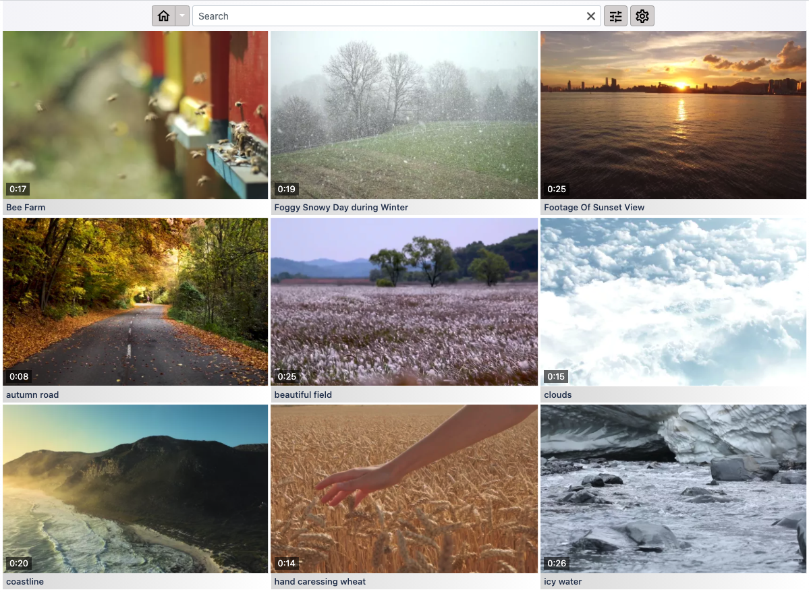

# Amony

A simple web app that scans a local directory for `.mp4` files and allows you to browse & play them in a web browser.

See the screenshot below: 



A live demo is available at [https://amony.nl](https://amony.nl). It is running on single [GCE](https://cloud.google.com/compute/) `e2-micro` instance.

All example videos were sourced from the [Pexels](https://www.pexels.com).

# How to use

For now there are no pre-packaged binaries, so you will have to build it yourself. Start by cloning this repo. 

## Development mode

### Prerequisites
- [npm](https://docs.npmjs.com/downloading-and-installing-node-js-and-npm)
- [scala 2.13](https://scala-lang.org/) & [sbt](https://www.scala-sbt.org/)
- [fmpeg](https://ffmpeg.org/)

### 1. Prepare your .mp4 files

In dev mode the `.mp4` files are expected to in a directory named `videos` inside the git repository. Move them there or create a symbolic link.

### 2. Start the server
```
cd server
sbt run
```

The server is now running on port `8080`. It will start scanning the `videos` directory and log its progress.

### 3. Start the web client
```bash
cd web-client
npm install --save
npm start
```

The web-client is now running on port `3000`. It will proxy all api requests to port `8080`.

### 4. Open your web browser

Set location to `localhost:3000`


## 'Production' mode

## Prerequisites

- [npm](https://docs.npmjs.com/downloading-and-installing-node-js-and-npm)
- [scala 2.13](https://scala-lang.org/) & [sbt](https://www.scala-sbt.org/)
- [docker](https://www.docker.com/get-started)

## Start the app in 'production mode'

### 1. Build the web client

```bash
cd web-client
npm install --save
npm run build
```

### 2. Build the server

```
cd server
sbt assembly
```

### 3. Build the docker image

```
docker build -t my-amony-app:latest .
```

The first time this can take a bit longer since it downloads & installs all dependencies for `ffmpeg`.

### 4. Run the docker image

```bash
docker run -v /path/to/my/videos:/usr/local/amony/videos -p 8080:8080 my-amony-app:latest
```