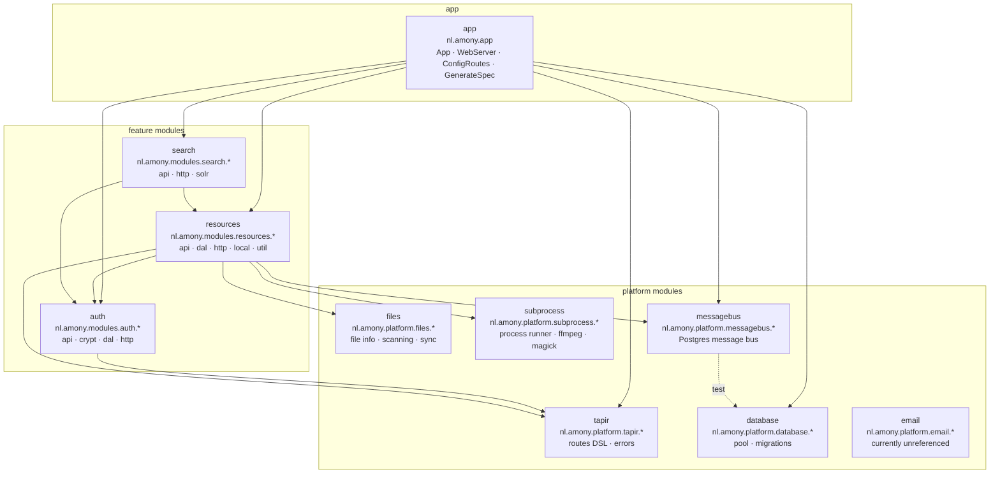

# Backend module graph

Current sbt module layout and dependencies. Arrows point from a module to the module it depends on; the dashed edge is
test-only.

```mermaid
flowchart TB
  subgraph app_group["app"]
    app["app<br/>nl.amony.app<br/>App · WebServer · ConfigRoutes · GenerateSpec"]
  end

  subgraph feature_group["feature modules"]
    auth["auth<br/>nl.amony.modules.auth.*<br/>api · crypt · dal · http"]
    resources["resources<br/>nl.amony.modules.resources.*<br/>api · dal · http · local · util"]
    search["search<br/>nl.amony.modules.search.*<br/>api · http · solr"]
  end

  subgraph platform_group["platform modules"]
    tapir["tapir<br/>nl.amony.platform.tapir.*<br/>routes DSL · errors"]
    files["files<br/>nl.amony.platform.files.*<br/>file info · scanning · sync"]
    subprocess["subprocess<br/>nl.amony.platform.subprocess.*<br/>process runner · ffmpeg · magick"]
    database["database<br/>nl.amony.platform.database.*<br/>pool · migrations"]
    messagebus["messagebus<br/>nl.amony.platform.messagebus.*<br/>Postgres message bus"]
    email["email<br/>nl.amony.platform.email.*<br/>currently unreferenced"]
  end

  app --> auth
  app --> resources
  app --> search
  app --> tapir
  app --> database
  app --> messagebus

  auth --> tapir

  resources --> auth
  resources --> tapir
  resources --> files
  resources --> subprocess
  resources --> messagebus

  search --> auth
  search --> resources

  messagebus -.->|test| database
```
